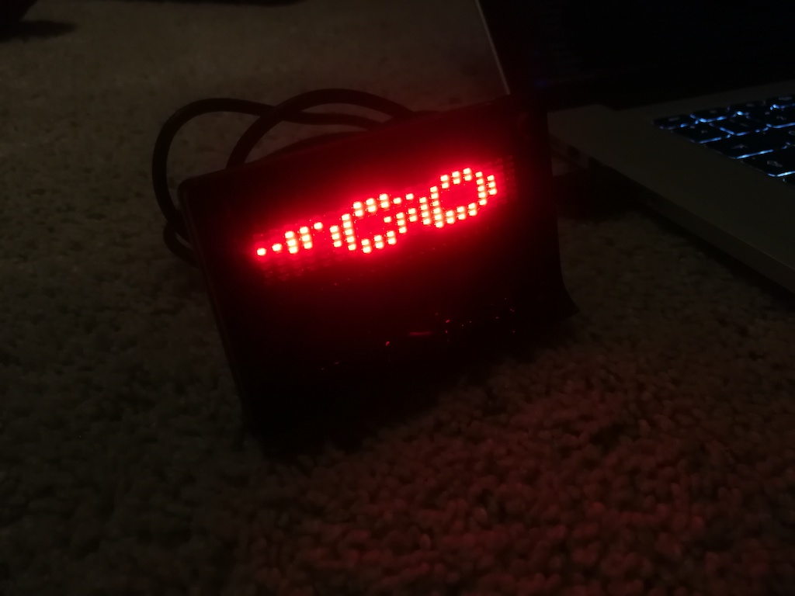

# go-dcled

Go library for interacting with Dream Cheeky Message Board



## Usage

You can load images (best: 21x7px like  or ) and display them on the LED message board. Any pixel (R: 255 G: 0 B: 0) will cause a LED to be *on*.

```go
package main

import (
	"fmt"
	"image/png"
	"os"
	"time"

	"github.com/karalabe/hid"
	"github.com/redtoad/go-dcled"
)

func main() {
	var list = hid.Enumerate(0x1D34, 0x0013)
	var device, err = list[0].Open() // Use first device
	if err != nil {
		panic(err)
	}

	println(fmt.Sprintf("Connected to %s %s", device.Manufacturer, device.Product))

	// load image from file
	f, err := os.Open("go-logo.png")
	if err != nil {
		panic(err)
	}
	defer f.Close()

	img, err := png.Decode(f)
	if err != nil {
		panic(err)
	}

	// display image on device
	for {
		dcled.DisplayCanvas(img, device)
		time.Sleep(dcled.MinimumRefreshRate)
	}
}
``` 

See `examples/` for more information.

Based on code by [MylesIsCool](https://gist.github.com/FormallyMyles/227a64a679fb0fc8432fe1c342f526dd). 
Very helpful: [The Last Outpost ](https://www.last-outpost.com/~malakai/dcled/)